# Apple vs Samsung — Competitive Financial & Market Analysis


> A full-stack financial data science project: data collection, cleaning, EDA, financial statement analysis, and macroeconomic regression — comparing two of the world's largest technology companies across a decade of market data.

---

## Highlights

| Metric | Apple (AAPL) | Samsung (005930.KS) |
|--------|-------------|---------------------|
| Total Return (2015–2026) | **~1,016%** | **~956%** |
| Annualized Return | 31.0% | 30.5% |
| Annualized Volatility | 29.4% | 29.9% |
| Sharpe Ratio | 1.05 | 1.02 |
| Avg Gross Margin (2022–2025) | **45.1%** | 36.2% |
| Avg Net Margin (2022–2025) | **25.4%** | 12.0% |
| Macro R² (CPI + 10Y yield) | 1.6% | 2.3% |

> **Key insight:** Despite being direct product competitors, the two stocks have a daily return correlation of just **r = 0.068** — they largely trade independently due to different exchanges, currencies, and business mix.

---

## Skills Demonstrated

- **Data Engineering** — automated ingestion from Yahoo Finance (`yfinance`) and Federal Reserve (FRED via `pandas-datareader`); multi-source merging on a shared time index
- **Data Cleaning** — handling multi-level column headers, currency scaling (USD billions / KRW trillions), NaN management across mismatched trading calendars (NYSE vs KRX)
- **Exploratory Data Analysis** — normalized price comparison, rolling statistics, year-by-year correlation decomposition, descriptive performance metrics
- **Financial Analysis** — income statement parsing, margin analysis, free cash flow trends, cross-currency comparisons
- **Statistical Modelling** — OLS regression (statsmodels), coefficient interpretation, R² and F-statistic reporting, residual diagnostics
- **Data Visualization** — 11 production-quality matplotlib/seaborn charts with consistent styling (color scheme, formatters, grid)

---

## Visualizations

### Stock Price Performance (Normalized, Base = 100)
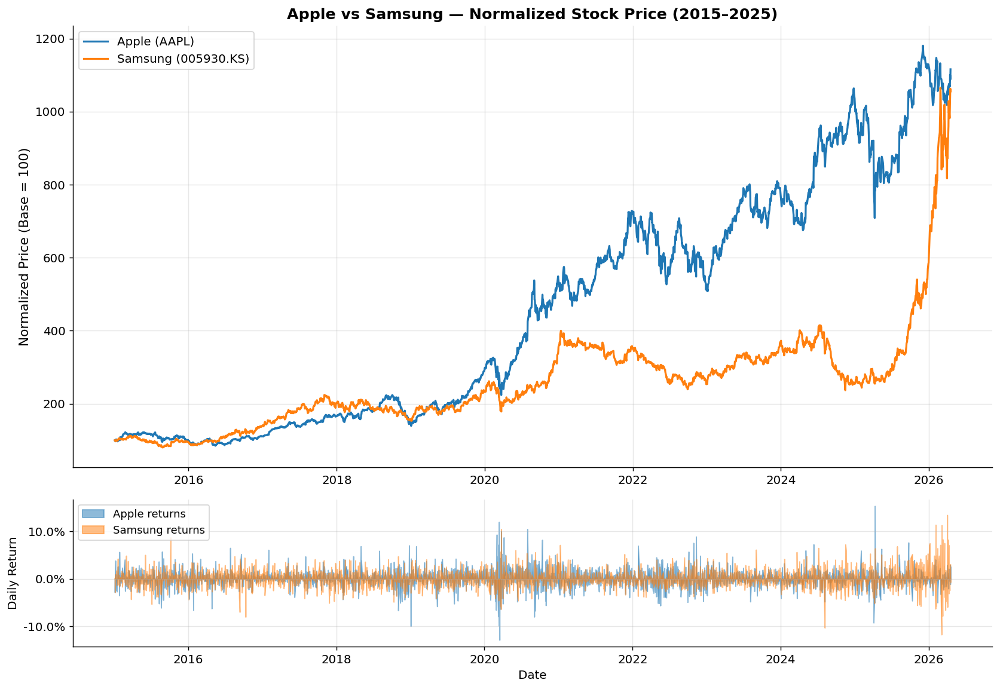

### Rolling Correlation of Daily Returns
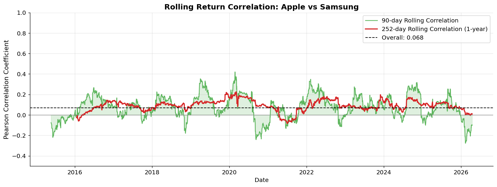

### Annual Return Scatter & Correlation by Year
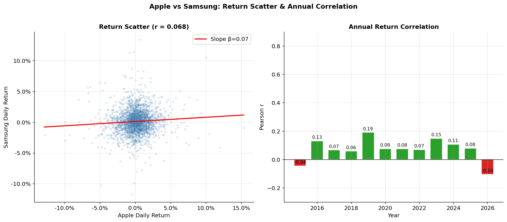

### Revenue & Net Income Comparison
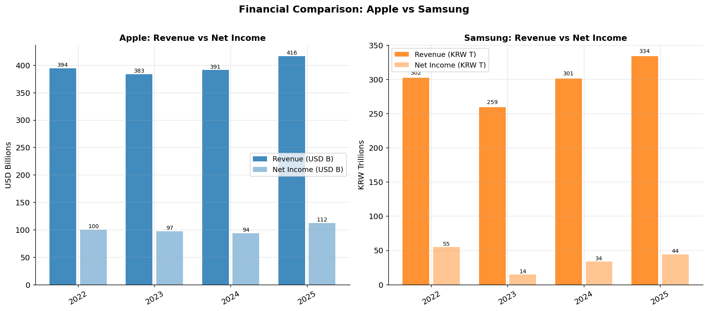

### Profit Margins (Gross / Operating / Net)
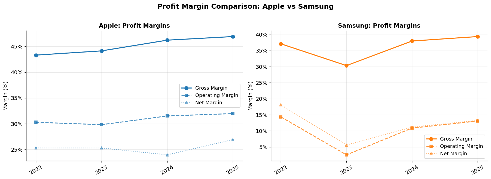

### Free Cash Flow Analysis
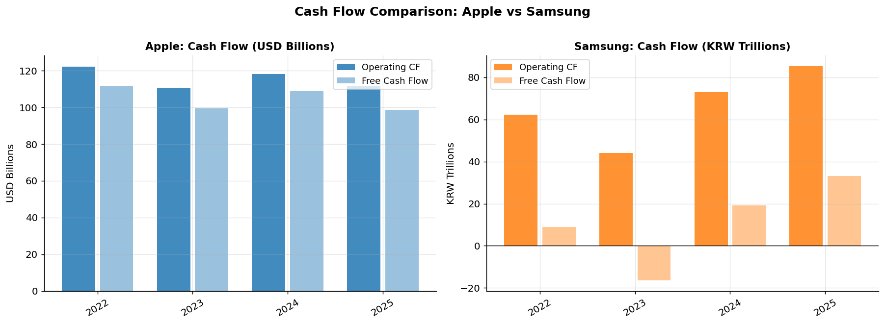

### US Macro Environment (CPI & 10Y Treasury)
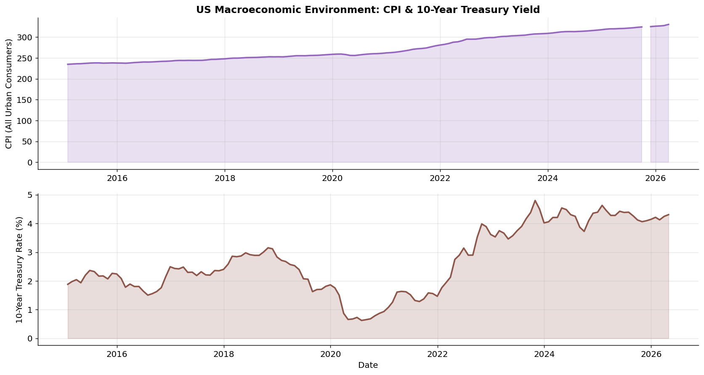

### OLS Regression — Actual vs Fitted
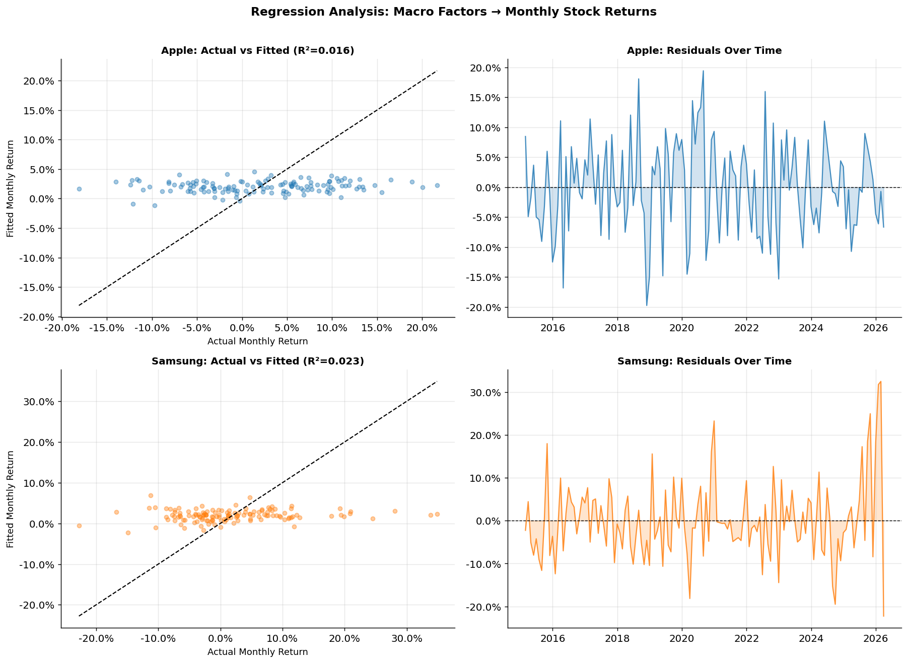

### Macro Factor Coefficients
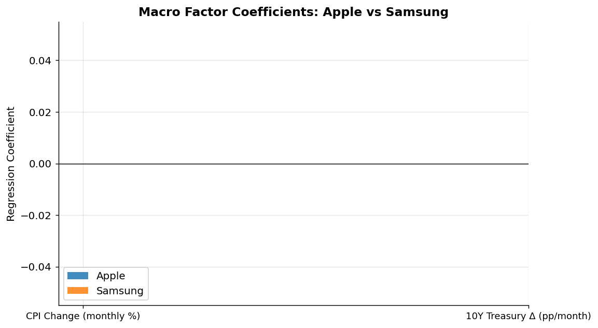

### Correlation Heatmap (Returns + Macro Variables)
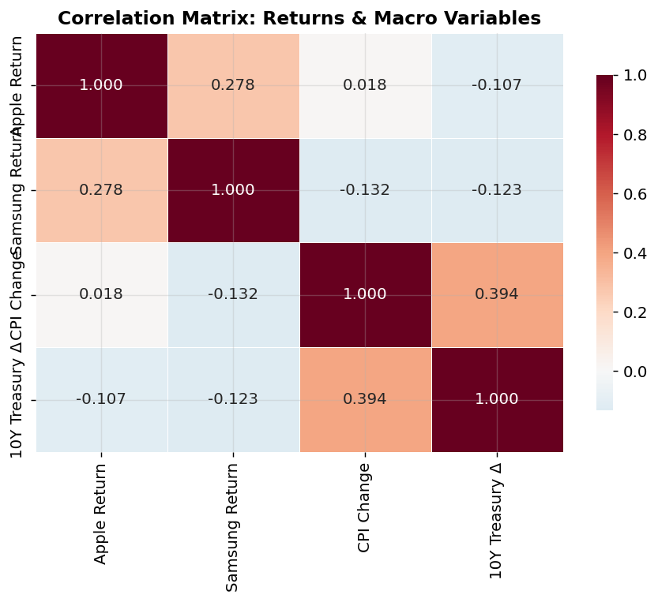

### 60-Day Rolling Volatility
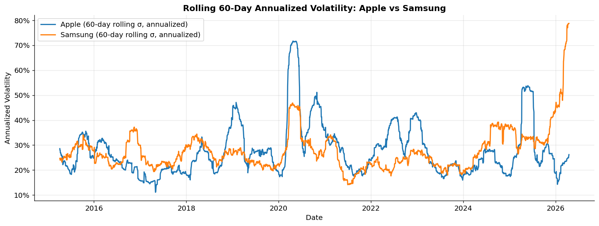

---

## Research Questions & Findings

### RQ1 — Stock Performance & Correlation
- Both stocks delivered **~1,000% total returns** over 2015–2026 with nearly identical Sharpe ratios (~1.0), making them equally efficient on a risk-adjusted basis.
- **Daily return correlation is very low (r = 0.068)** — the stocks behave like independent assets despite Apple and Samsung competing for the same consumer hardware markets.
- Rolling correlation spikes during broad market stress (COVID-19 March 2020) but collapses at other times, confirming the relationship is **regime-dependent**.

### RQ2 — Financial Fundamentals
- **Apple consistently outperforms on profitability**: gross margin ~47% vs Samsung ~37%; net margin ~25% vs ~12%, reflecting Apple's premium brand and high-margin Services segment.
- Apple generates **~$100B/year in free cash flow** with remarkable consistency. Samsung's FCF turned negative in 2023 due to heavy semiconductor capital expenditure.
- Samsung's revenue and margins are tightly coupled to the **global semiconductor cycle** — a 2023 downturn cut operating margins from 14% to 2.5%, followed by a strong 2024–2025 recovery.

### RQ3 — Macroeconomic Regression
- OLS models using CPI change and 10Y Treasury yield change explain only **~1.6% (Apple)** and **~2.3% (Samsung)** of monthly return variance — F-statistics are not significant at 5%.
- Coefficient signs are **directionally consistent with theory**: rising rates carry a negative coefficient for both stocks, aligning with the DCF discount rate mechanism for growth equities.
- The bulk of return variation is driven by **firm-specific factors** (earnings surprises, product cycles, semiconductor inventory dynamics, geopolitical events).

---

## Project Structure

```
.
├── Apple_vs_Samsung_Analysis.ipynb   ← main analysis notebook
│
├── data/
│   ├── stock_prices.csv              # daily OHLCV — Apple & Samsung (2015–2026)
│   ├── apple_income_stmt.csv
│   ├── apple_balance_sheet.csv
│   ├── apple_cash_flow.csv
│   ├── samsung_income_stmt.csv
│   ├── samsung_balance_sheet.csv
│   ├── samsung_cash_flow.csv
│   ├── fred_macro.csv                # CPI + 10Y Treasury (merged)
│   ├── fred_cpi_us.csv
│   └── fred_treasury_10y.csv
│
├── notebooks/
│   └── Data_download.ipynb           # data collection script
│
├── plots/                            # 11 output charts (PNG)
│
└── presentation/
    ├── Apple_vs_Samsung_Presentation.pdf
    ├── Apple_vs_Samsung_Presentation.pptx
    └── slides/                       # slide-by-slide JPEGs
```

---

## Data Sources

| Source | Method | Coverage | Variables |
|--------|--------|----------|-----------|
| [Yahoo Finance](https://finance.yahoo.com) | `yfinance` | 2015–2026 (daily / annual) | OHLCV prices; Revenue, Net Income, Gross Profit, Operating Income, Free Cash Flow |
| [FRED — Federal Reserve](https://fred.stlouisfed.org) | `pandas-datareader` | 2015–2026 (monthly) | `CPIAUCSL` — US CPI; `DGS10` — 10-Year Treasury Rate |

**Companies:** Apple Inc. (AAPL · NASDAQ) · Samsung Electronics (005930.KS · KRX)

---

## Setup & Run

```bash
pip install yfinance pandas numpy matplotlib seaborn statsmodels pandas-datareader
```

Run notebooks in order:

```
1. notebooks/Data_download.ipynb         # downloads + saves all CSVs
2. Apple_vs_Samsung_Analysis.ipynb       # loads CSVs, runs analysis, generates plots
```

> All CSVs are already committed — you can skip step 1 and run the analysis notebook directly.

---

## Limitations

- **Currency**: Samsung prices are in KRW; analyses do not adjust for USD/KRW exchange-rate movements.
- **Financial history**: Only 4–5 years of annual statements available via `yfinance`, limiting longer-term trend analysis.
- **Omitted variables**: Macro regression excludes market beta (S&P 500 / KOSPI), earnings momentum, and sector factors.
- **Survivorship bias**: Both companies are dominant industry leaders; results may not generalize to the broader tech sector.

---

## References

1. Yahoo Finance — Apple Inc. (AAPL) & Samsung Electronics (005930.KS)
2. Federal Reserve Bank of St. Louis (FRED) — CPIAUCSL, DGS10
3. McKinney, W. (2010). *Data Structures for Statistical Computing in Python*. SciPy Proceedings.
4. Seabold, S. & Perktold, J. (2010). *Statsmodels: Econometric and Statistical Modeling with Python*. SciPy Proceedings.
